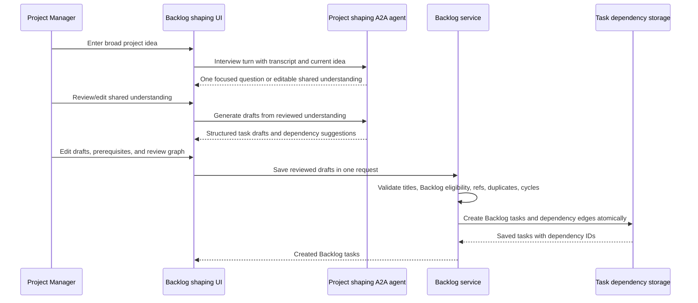
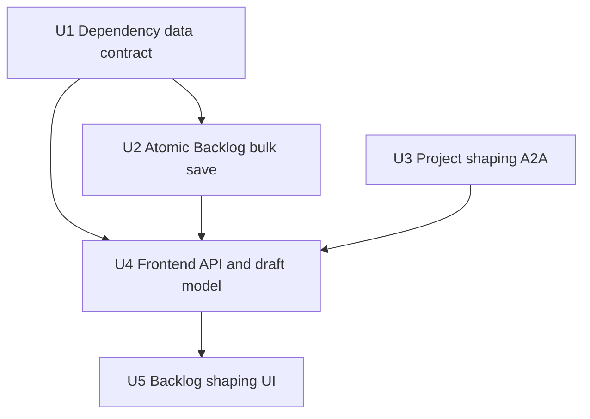

# feat: Add project-level task shaping

## Summary

Add a Backlog-started project shaping flow by extending Kanai's existing A2A review-gate pattern: interview to editable shared understanding, generate editable task drafts, then atomically save reviewed Backlog tasks and real dependency links. The first slice includes dependencies from generated tasks to other generated tasks or existing same-project Backlog tasks, plus a read-only graph in the draft review step.

---

## Problem Frame

Project managers currently have to break broad ideas into Backlog-ready tasks outside Kanai or through one manual task at a time. The implementation needs to preserve the brainstorm's two review gates while adding the missing durable dependency relationship that makes generated work breakdowns useful after save.

---

## Requirements

- R1. Start project-level shaping from the Backlog, not an individual task form.
- R2. Accept broad project-level ideas that may require multiple Backlog tasks.
- R3. Ask one focused question at a time in a grill-me-style interview.
- R4. Continue interviewing until task boundaries and dependency relationships are explicit enough for review.
- R5. Output shared understanding into an editable textarea before task drafts are generated.
- R6. Generate task drafts from the user-reviewed shared understanding.
- R7. Let each draft task edit title, description, acceptance criteria, and dependency links.
- R8. Keep draft tasks as small deliverables with clear independently reviewable outcomes.
- R9. Keep the draft list editable before saving.
- R10. Save no generated task until the Project Manager explicitly saves the reviewed draft list.
- R11. Save reviewed tasks into the Backlog.
- R12. Persist dependency links as real task relationships, not notes in descriptions.

**Origin actors:** A1 Project Manager, A2 Kanai Shaping Agent
**Origin flows:** F1 Shape an idea into shared understanding, F2 Generate and save reviewed task drafts
**Origin acceptance examples:** AE1 shared understanding gate, AE2 editable draft review gate, AE3 real dependency persistence

---

## Scope Boundaries

- Preserve the origin boundary that the first slice does not save tasks before draft review.
- Preserve the origin boundary that this is a fresh project-level flow, not a single-task shaping extension in the task form.
- Preserve the origin boundary that generated tasks do not all need to be parallelizable; real dependencies are allowed.
- Preserve the origin boundary that manual Backlog task creation remains available.
- The dependency graph is read-only review aid in this slice, not a drag-and-drop dependency editor.
- Generated tasks may depend on existing same-project Backlog tasks, but existing tasks will not be edited to depend on newly generated tasks in this slice.
- Shaping chat transcripts remain ephemeral unless a future requirement asks for durable transcript history.

### Deferred to Follow-Up Work

- Rich dependency management on saved tasks: editing dependency links after save can be added once Kanai needs ongoing dependency maintenance outside this creation flow.
- Dependencies involving active sprint or Done tasks: keep the first slice focused on Backlog planning inputs.
- Server-side idempotency keys for save retry: disable duplicate client submits first; add idempotency only if timeout retries create real duplicates.

---

## Context & Research

### Relevant Code and Patterns

- `api/app/features/a2a/task_shaping.py` and `api/app/features/a2a/router.py` provide the existing protected A2A shaping pattern, structured output, project access check, and artifact return boundary.
- `client/src/api/client/a2a.ts` normalizes A2A artifacts for the UI and is the right client-owned API surface to extend.
- `client/src/domains/workspace/ui/TaskShapingChat.tsx` proves the review-gate pattern: AI drafts stay local until a user applies/saves them.
- `api/app/services/project_backlog_service.py` owns Backlog list/reorder/create semantics, including non-sprint tasks, first non-Done workflow column, and Backlog ranks.
- `api/app/models/task.py`, `api/app/schemas/task.py`, and `api/app/repositories/task_repository.py` are the current task data surfaces; no product task dependency model exists yet.
- `client/src/domains/workspace/ui/ProjectBoardPage.tsx` renders the Backlog view and existing “Add Backlog Task” entry point.
- `client/src/api/client/tasks.ts` and `client/src/api/client/kanai-api.ts` are the app-owned task/backlog client facade; generated OpenAPI types are not used directly by UI components.

### Institutional Learnings

- Backlog is a planning list, not a workflow column; keep new output anchored to Backlog and avoid Sprint semantics.
- AI output must remain behind explicit review/save gates; generated content should update local draft state until the user saves.
- Structured artifacts are preferred over parsing prose from model output.
- Existing A2A access rules are settled: public agent card, protected invocation, project access before model call.
- Repo instruction: API schema changes do not require a database migration for now.

### External References

- SQLAlchemy self-referential association guidance supports an explicit association table rather than implicit self-referential lazy relationships.
- SQLAlchemy async transaction guidance supports service-owned transaction boundaries with one commit/rollback for bulk save.
- PostgreSQL-style integrity guidance supports foreign keys, uniqueness, and self-edge checks, with graph cycle validation in service code.
- WAI form/dialog guidance applies if the review UI is presented as an overlay; use native form controls and visible error text.

---

## Key Technical Decisions

- Add one directed task dependency edge model using canonical prerequisite vocabulary: “dependent task depends on prerequisite task.” This keeps R12 durable without adding dependency types Kanai has not needed yet.
- Include project ownership on dependency edges and enforce same-project reads through route/project context. This avoids cross-project leakage even if corrupted or malicious dependency IDs reach storage.
- Keep dependency graph validation in the Backlog service. Database constraints catch duplicates and self-edges, but service validation must check missing refs, cross-project refs, existing persisted edges, and cycles before any partial save.
- Add an atomic bulk Backlog save endpoint rather than looping over the existing single-task endpoint. R10 and R12 require all reviewed tasks and dependency links to commit or roll back together.
- Let the project-shaping A2A agent own stable draft keys in structured output. The frontend preserves those keys during review and sends them back for save.
- Use an explicit A2A operation discriminator for interview turns versus draft generation. The contract should not infer behavior from transcript shape.
- Expose prerequisite IDs in task read responses once dependencies exist. This makes saved relationships observable for clients and tests without building a full dependency-management UI.
- Add a new project-level A2A agent surface instead of overloading the single-task form shaping agent. The existing agent shapes one task form; this flow has a different source, readiness gate, and output contract.
- Treat edited shared understanding as the source of truth for draft generation. If the textarea changes after drafts are generated, mark drafts stale and require regeneration before save.
- Bound user- and model-controlled payloads in this new flow: draft count, prerequisites per draft, transcript length, shared-understanding length, and editable task text lengths.
- Render a read-only dependency graph from draft review state using existing React/CSS/SVG primitives first. Chips/selectors remain the editing controls; the graph helps review without adding graph-editing or a new graph library.

---

## Open Questions

### Resolved During Planning

- Should generated drafts be able to depend on existing Backlog tasks? Yes. The user selected this during scope confirmation; restrict it to same-project Backlog prerequisites for the first slice.
- Should the first slice include a graph UI? Yes. The user selected a graph visualization during scope confirmation; keep it read-only.
- Should the first slice edit existing tasks to depend on generated tasks? No. That would mutate already-saved work and expands the review boundary beyond generated drafts.
- How should dependency delete semantics work? Use explicit repository cleanup plus database cascade defense-in-depth on task deletion for this slice so dependency edges never dangle; add richer delete warnings only when Kanai adds dependency management UX.
- Who may shape and bulk-save Backlog tasks? Match existing Backlog task creation access for the first slice: authenticated project members with current project access may invoke project shaping and save reviewed tasks.
- How should prerequisite eligibility behave when a project has no Done Column designation? Follow current Backlog semantics: same-project, non-sprint tasks are eligible; no Done-specific exclusion applies until a Done Column is designated.
- What payload bounds should apply? Use conservative first-slice caps: at most 12 generated drafts, at most 5 prerequisites per draft, at most 20 transcript entries, shared understanding capped around 8k characters, and task title/description/acceptance text capped to UI-manageable lengths. If the interview hits the transcript cap before readiness, stop draft generation and ask the user to narrow or summarize the idea.

### Deferred to Implementation

- Exact copy and layout of the graph and review controls: settle while fitting the existing Backlog page design system.
- Exact model prompt wording: refine during implementation against structured output tests and prompt readability.

---

## High-Level Technical Design

> *This illustrates the intended approach and is directional guidance for review, not implementation specification. The implementing agent should treat it as context, not code to reproduce.*

---

## Implementation Units

### U1. Dependency data contract

**Goal:** Add the minimal durable representation and read contract for task dependency links.

**Requirements:** R7, R12, AE3

**Dependencies:** None

**Files:**
- Modify: `api/app/models/task.py`
- Modify: `api/app/schemas/task.py`
- Modify: `api/app/repositories/task_repository.py`
- Modify: `api/app/features/tasks/service.py`
- Test: `api/tests/services/test_project_backlog_service.py`
- Test: `api/tests/modules/project/test_project_router.py`
- Test: `api/tests/services/test_task_move_workflow.py`

**Approach:**
- Add a directed dependency edge model in the existing task model surface to avoid a new model import path and migration requirement.
- Store prerequisite relationships between tasks with project ownership, cascade cleanup, and a self-edge guard.
- Keep ORM relationships out of the first slice; use explicit project-scoped repository queries to avoid async lazy-loading surprises and cross-project leakage.
- Delete dependency edges explicitly in repository task deletion paths before deleting tasks, while keeping database cascade as defense-in-depth for environments that enforce it.
- Extend task read schemas and mapping so callers can observe which prerequisite task IDs a task depends on across Backlog and non-Backlog task read paths.

**Patterns to follow:**
- `api/app/models/task.py` for SQLModel column style and task table conventions.
- `api/app/schemas/task.py` for Pydantic `ConfigDict(extra="forbid")`, `from_attributes`, and existing task field naming.
- `api/app/repositories/task_repository.py` for explicit async SQLAlchemy queries.

**Test scenarios:**
- Happy path: a task with two prerequisite edges is read through repository/API mapping with those prerequisite IDs present.
- Happy path: `/projects/{project_id}/tasks`, Backlog reads, active sprint reads, and task detail/update/move responses expose dependency fields consistently.
- Edge case: a task with no prerequisites returns empty dependency lists rather than null.
- Error path: a self-dependency is rejected by model/service validation and cannot be persisted as a valid edge.
- Error path: corrupt or cross-project dependency edges do not leak IDs through project-scoped reads.
- Integration: deleting either side of a dependency removes associated dependency edges without leaving dangling rows, including SQLite-backed tests that do not enforce FK cascades by default.

**Verification:**
- Task dependency edges are durable project-scoped rows, not description text.
- Existing task reads remain backward-compatible except for added prerequisite fields.
- SQLModel metadata includes the dependency table without adding an Alembic migration.

---

### U2. Atomic Backlog bulk save

**Goal:** Save reviewed task drafts and their dependency links into Backlog in one all-or-nothing service operation.

**Requirements:** R7, R8, R10, R11, R12, F2, AE2, AE3

**Dependencies:** U1

**Files:**
- Modify: `api/app/schemas/task.py`
- Modify: `api/app/api/v1/endpoints/projects.py`
- Modify: `api/app/services/project_backlog_service.py`
- Modify: `api/app/repositories/task_repository.py`
- Test: `api/tests/services/test_project_backlog_service.py`
- Test: `api/tests/modules/project/test_project_router.py`

**Approach:**
- Add a bulk-create Backlog request schema for reviewed draft tasks with stable client keys, task fields, and prerequisite references.
- Support discriminated prerequisite references that point either to another draft key or to an existing same-project Backlog task ID, so draft keys and task IDs cannot collide.
- Validate non-empty draft list, text/count limits, nonblank titles, duplicate client keys, missing references, self-dependencies, duplicate references, cross-project/excluded existing tasks, and cycles before commit.
- Build cycle checks from existing same-project persisted dependency edges plus the proposed draft edges so a new save cannot complete an older cycle.
- Return IDOR-safe validation errors for nonexistent, unauthorized, cross-project, sprint, or Done prerequisite IDs; do not reveal which invalid IDs exist elsewhere.
- Assign distinct new task IDs plus distinct Backlog ranks and board ranks in memory so saved tasks appear at the top of Backlog in the reviewed draft order for empty and non-empty Backlogs.
- Own the transaction in `ProjectBacklogService`; use direct session add/flush or non-committing repository helpers, never per-task repository methods that commit after each task.
- Return saved tasks with prerequisite fields after one successful commit.

**Execution note:** Start with backend service tests for atomicity and dependency validation before adding the route.

**Patterns to follow:**
- `ProjectBacklogService.create_task` for Backlog column selection, `sprint_id=None`, task rank, and Backlog rank semantics.
- `ProjectBacklogService.reorder` for complete-list validation and clear `422` errors.
- `api/tests/modules/project/test_project_router.py` for authenticated route and project access coverage.

**Test scenarios:**
- Happy path: three reviewed drafts save as Backlog tasks in the same order, with one draft depending on another generated draft and one draft depending on an existing Backlog task.
- Happy path: a project member with existing Backlog task creation access can bulk-save reviewed drafts.
- Happy path: empty and non-empty Backlogs receive distinct Backlog ranks and board ranks while preserving reviewed order before existing tasks.
- Happy path: when no Done Column is designated, existing non-sprint project tasks are eligible prerequisites under current Backlog semantics.
- Edge case: zero drafts or over-limit draft/prerequisite/text payloads return validation failure and create no tasks.
- Edge case: duplicate prerequisite references are rejected with no duplicate edge rows.
- Error path: missing draft key, nonexistent existing task ID, cross-project task ID, active sprint task ID, Done task ID when a Done Column is designated, self-edge, and dependency cycle each return validation failure and create no tasks or edges.
- Error path: a new draft edge that would complete a cycle through existing persisted dependencies is rejected with no rows created.
- Error path: cross-project and nonexistent prerequisite IDs fail with indistinguishable invalid-prerequisite errors and create no rows.
- Error path: one invalid task payload in a multi-draft request rolls back the entire operation.
- Error path: tasks flushed before a dependency/constraint failure are rolled back and do not remain in Backlog.
- Integration: non-member access is rejected before any task or dependency row is created.
- Integration: after successful save, refetching Backlog shows the new tasks and prerequisite IDs.

**Verification:**
- R10 is enforced by a single explicit save boundary.
- R11 is enforced by Backlog rank and non-sprint task semantics.
- R12 is enforced by real project-scoped dependency edges and post-save read visibility.

---

### U3. Project shaping A2A agent

**Goal:** Add a project-level shaping A2A contract that interviews toward shared understanding and generates structured task drafts from the reviewed understanding.

**Requirements:** R1, R2, R3, R4, R5, R6, R8, F1, F2, AE1, AE2

**Dependencies:** None

**Files:**
- Create: `api/app/features/a2a/project_task_shaping.py`
- Modify: `api/app/features/a2a/router.py`
- Modify: `api/app/features/a2a/__init__.py`
- Test: `api/tests/features/test_a2a_router.py`

**Approach:**
- Register a distinct project-level shaping agent with its own card, parser, generator protocol, structured output models, and prompt builder.
- Keep the same A2A route infrastructure and require authentication plus project access before fetching Backlog context or calling the generator.
- Ensure the public agent card exposes only static capability/schema metadata, not project names, task titles, user data, prompt text, or private URLs.
- Let the same agent handle two explicit structured operations: interview turns that return one focused question or editable shared understanding, and draft generation from the reviewed shared understanding.
- Return typed draft tasks with agent-owned stable draft keys and discriminated prerequisite references instead of markdown task lists.
- Include only minimal existing Backlog context for prerequisite suggestions after access check: task IDs and titles, capped by rank/relevance, excluding sprint and Done tasks.
- Send only the minimum same-project Backlog fields needed for suggestions; never include prompt/context/transcript contents in public cards, client errors, or normal logs; follow existing A2A/model privacy settings and keep transcripts non-durable.
- Enforce transcript, shared-understanding, existing Backlog context, draft count, prerequisite count, and draft text limits at the parser/model boundary.

**Execution note:** Add characterization-style tests around the new A2A contract before connecting it to frontend UI.

**Patterns to follow:**
- `api/app/features/a2a/task_shaping.py` for Pydantic output models, prompt assembly, and invalid-param handling.
- `api/app/features/a2a/router.py` for agent registration, protected invocation, event queue updates, and artifact emission.
- `api/tests/features/test_a2a_router.py` for stub generators and protected A2A route tests.

**Test scenarios:**
- Happy path: agent card is reachable without bearer auth, advertises JSON input/output for project-level shaping, and contains no project/task/user/prompt data.
- Happy path: authenticated project member invokes an interview operation and receives exactly one focused question when the understanding is not ready.
- Happy path: when the generator marks understanding ready, the artifact includes editable shared understanding text and no saved tasks are created.
- Happy path: draft-generation operation uses the reviewed shared understanding value supplied by the client, not a hidden transcript-only value.
- Happy path: existing Backlog prerequisite context excludes sprint and Done tasks before generation.
- Edge case: malformed operation payload, missing project ID, malformed transcript, duplicate/missing draft keys, or over-limit payloads returns A2A invalid-params behavior.
- Edge case: interview reaches transcript cap before shared-understanding readiness, so draft generation is blocked and the user is asked to narrow or summarize the idea.
- Error path: malformed generator output returns a retryable generation failure without saving or exposing raw model content.
- Error path: non-member invocation is rejected before Backlog context lookup and before model generation.
- Integration: structured draft output can include discriminated dependencies to generated draft keys and existing Backlog task IDs without requiring prose parsing.

**Verification:**
- R3 and R4 are represented in prompt/contract tests without live model calls.
- R5 and R6 are separated into explicit structured states.
- The A2A boundary stays consistent with the existing SDK integration.

---

### U4. Frontend API and draft model

**Goal:** Add client-side contracts and small draft-state helpers that connect project shaping, dependency validation, graph data, and atomic save.

**Requirements:** R5, R6, R7, R8, R9, R10, R12, AE1, AE2, AE3

**Dependencies:** U1, U2, U3

**Files:**
- Modify: `client/src/api/client/a2a.ts`
- Modify: `client/src/api/client/tasks.ts`
- Modify: `client/src/api/client/kanai-api.ts`
- Modify: `client/src/api/client/index.ts`
- Create: `client/src/domains/workspace/model/projectBacklogShaping.ts`
- Test: `client/src/api/client/a2a.test.ts`
- Test: `client/src/api/client/tasks.test.ts`
- Test: `client/src/api/client/kanai-api.test.tsx`
- Test: `client/src/domains/workspace/model/projectBacklogShaping.test.ts`

**Approach:**
- Extend the app-owned A2A client with project-level shaping calls and artifact normalization, following the existing single-task shaping client.
- Extend task/backlog client types and mappers for dependency fields and bulk Backlog create.
- Add a tiny domain helper for draft keys, editable draft values, prerequisite options, generated-draft cycle/missing-reference validation, stale draft detection, and graph nodes/edges.
- Keep frontend validation as UX preflight only; backend validation remains authoritative for existing persisted dependencies and all save requests.
- Invalidate Backlog and task queries after successful bulk save.

**Patterns to follow:**
- `client/src/api/client/a2a.ts` normalization of malformed model artifacts and custom-response handling.
- `client/src/api/client/tasks.ts` JSON mapping between API snake_case and app camelCase types.
- `client/src/api/client/kanai-api.ts` React Query invalidation facade.
- `client/src/domains/workspace/model/useTaskForm.ts` for small state helpers with focused tests.

**Test scenarios:**
- Happy path: project shaping interview client extracts the structured artifact and normalizes a focused question.
- Happy path: draft-generation client returns editable draft tasks with discriminated generated and existing prerequisite references.
- Happy path: bulk save sends reviewed draft values and discriminated prerequisite references, not original generated values.
- Edge case: malformed or unrelated stream artifacts are ignored until a valid project-shaping artifact arrives, while server-reported generation failures surface as retryable errors.
- Edge case: editing shared understanding after draft generation marks drafts stale.
- Error path: missing generated-draft reference, self-edge, duplicate edge, and generated-draft cycle are detected in client draft state and block save.
- Integration: successful bulk save invalidates Backlog/task caches and maps returned prerequisite IDs onto client task objects across normal task and Backlog read paths.

**Verification:**
- Frontend has no prose parsing for task drafts or dependencies.
- Save payloads are built from current review state.
- Client helpers remain small and testable rather than embedded in the page component.
- The graph/selectors improve usability but are not treated as a security or data-integrity boundary.

---

### U5. Backlog shaping UI

**Goal:** Add the Backlog entry point and review workflow that lets a Project Manager shape, review, visualize, and save generated Backlog tasks.

**Requirements:** R1, R2, R3, R4, R5, R6, R7, R8, R9, R10, R11, R12, F1, F2, AE1, AE2, AE3

**Dependencies:** U4

**Files:**
- Modify: `client/src/domains/workspace/ui/ProjectBoardPage.tsx`
- Create: `client/src/domains/workspace/ui/ProjectBacklogShapingFlow.tsx`
- Test: `client/src/domains/workspace/ui/ProjectBoardPage.test.tsx`
- Test: `client/src/domains/workspace/ui/ProjectBacklogShapingFlow.test.tsx`

**Approach:**
- Add a “Shape project idea” entry point beside manual Backlog task creation.
- Open an inline shaping panel from the Backlog toolbar, above the Backlog list, with ordered sections: idea/interview, shared understanding, draft review/dependencies, and save.
- Keep the flow local to the Backlog view: broad idea input, interview transcript, one active question at a time, editable shared-understanding textarea, generate drafts, editable draft cards, dependency selectors, read-only graph, and explicit save.
- Offer existing Backlog tasks as prerequisite options while preventing obvious invalid generated-draft graph choices in the draft review step.
- Render the graph with existing React/CSS/SVG primitives or a simple dependency-map layout; do not add a graph library unless the simple rendering becomes unreadable during implementation.
- Label the graph as selected direct dependencies only; do not imply it visualizes every prerequisite chain behind existing Backlog tasks.
- Provide a text edge list or table equivalent for the graph so dependency review is not SVG-only.
- Place validation errors where users can fix them: field-level for task text, dependency-row-level for prerequisite/cycle issues, and form-level for auth/network/unknown failures.
- Cover the core states explicitly: idle, asking/generating/saving, empty prerequisites, no dependency edges, stale drafts, validation blocked, API error, and saved success.
- If shared understanding changes after drafts exist, mark drafts stale and require regeneration before save.
- Disable save while saving, preserve all draft edits on save error, and refetch Backlog after success.
- Keep manual “Add Backlog Task” visible in the toolbar and unchanged.

**Execution note:** Implement UI behavior test-first around review gates and stale-draft behavior; styling can follow once states are covered.

**Patterns to follow:**
- `client/src/domains/workspace/ui/TaskShapingChat.tsx` for transcript, retry, draft application, stale draft warning, and review-gate state.
- `client/src/domains/workspace/ui/ProjectBoardPage.tsx` for Backlog page layout, error surfaces, and query refetching.
- `client/src/domains/workspace/ui/CreateTaskPage.test.tsx` and `ProjectBoardPage.test.tsx` for Testing Library route/query setup.

**Test scenarios:**
- Covers AE1. Happy path: from Backlog, user enters “implement authentication,” answers focused questions, then sees editable shared understanding before any task drafts are generated.
- Covers AE2. Happy path: after editing shared understanding, generated draft tasks render editable title, description, acceptance criteria, and dependency controls before save.
- Covers AE3. Happy path: user sets one generated task to depend on another generated task and one existing Backlog task, sees both in the read-only graph, saves, and Backlog refetch receives real dependency fields.
- Edge case: editing shared understanding after draft generation disables save until drafts are regenerated.
- Edge case: blank title in one draft shows a field-level error, blocks save, and keeps other draft edits intact.
- Edge case: no existing Backlog prerequisites and no selected dependency edges render clear empty states.
- Error path: invalid generated-draft dependency cycle shows a dependency-row error and disables save.
- Error path: A2A interview or draft-generation failure preserves transcript, shared understanding, and drafts with retry affordance.
- Error path: bulk save failure preserves reviewed draft edits and dependency selections, including server-rejected existing-task prerequisites.
- Integration: clicking save twice while a request is pending sends one save request.
- Integration: keyboard-only users can complete the flow with labeled controls, focus movement after async step changes, and `aria-live` status/error announcements.
- Integration: manual Backlog task creation link remains visible and routes as before.
- Integration: generated and user-edited content renders as inputs, textareas, or plain text labels only; no raw HTML rendering.

**Verification:**
- Backlog is the only entry point for this project-level flow.
- No generated task is persisted before explicit save.
- The review UI supports text editing, dependency editing, and graph inspection before persistence.

---

## System-Wide Impact

- **Interaction graph:** Backlog UI calls the project shaping A2A agent for interview/draft generation, then calls the Backlog bulk-save API for persistence. Existing single-task shaping remains isolated to task create/edit forms.
- **Error propagation:** A2A failures keep local shaping state; bulk-save validation failures return actionable errors without partial persistence; non-member access fails before Backlog context lookup, model generation, or database writes.
- **State lifecycle risks:** The main risks are stale drafts after shared-understanding edits, duplicate save clicks, partial writes, rank inversion, and dependency cycles through existing persisted edges. The plan handles these with stale-state gating, pending-save disablement, atomic transaction, explicit rank tests, and service-level graph validation.
- **API surface parity:** Task reads gain prerequisite fields for Backlog and non-Backlog task APIs; app-owned client mappers must expose the same fields consistently.
- **Read visibility:** Dependency read queries must be scoped through the authenticated project/task route so cross-project or corrupt edges cannot leak prerequisite IDs.
- **Integration coverage:** Unit tests alone will not prove the full flow; at least one frontend flow test and one backend route/service integration test must cover draft review through saved dependency visibility.
- **Unchanged invariants:** Backlog remains non-sprint planning work, manual task creation remains available, existing single-task shaping remains form-local, and no database migration is required for this schema change right now.

---

## Alternative Approaches Considered

- Loop over existing single Backlog task creation: rejected because it cannot satisfy all-or-nothing save or dependency creation without partial failures.
- Store dependency notes inside descriptions: rejected because the origin explicitly requires real persisted relationships.
- Add a full dependency graph editor: rejected for the first slice because normal form controls are simpler to validate and test; the graph is review-only.
- Reuse the existing single-task shaping agent: rejected because project-level shaping has different inputs, readiness state, and multi-task output.

---

## Success Metrics

- A Project Manager can complete the Backlog shaping flow without leaving Kanai or manually creating each task.
- Saved generated tasks appear in Backlog in reviewed order with dependency fields returned by the API.
- Invalid dependency graphs are caught before save and never create partial tasks.
- Manual Backlog task creation and existing single-task shaping behavior remain unchanged.

---

## Dependencies / Prerequisites

- Existing A2A SDK integration and project access checks remain available.
- Existing Backlog query and create semantics remain the source of truth for non-sprint Backlog tasks.
- Local database metadata creation in tests must include the new dependency table through existing model imports.

---

## Risk Analysis & Mitigation

| Risk | Likelihood | Impact | Mitigation |
|------|------------|--------|------------|
| Partial save creates some tasks without dependencies | Medium | High | Use one service-owned transaction and rollback on any validation or persistence error, including post-flush edge failures. |
| Dependency direction is inverted | Medium | High | Use prerequisite vocabulary consistently and test a concrete “Login UI depends on Auth API” scenario across DB, API, client, selector, and graph arrow. |
| Existing-task prerequisite points outside the valid Backlog scope | Medium | Medium | Validate existing prerequisites are same-project Backlog tasks before creating edges and return non-enumerating invalid-prerequisite errors. |
| A new edge completes a cycle through existing dependencies | Medium | High | Validate against existing project dependency edges plus proposed draft edges before commit. |
| Rank generation reverses reviewed draft order | Medium | Medium | Generate distinct board and Backlog ranks for every new task and test empty/non-empty Backlog insertion. |
| Public or protected A2A surfaces leak project data | Low | High | Keep agent cards static and require project access before Backlog context lookup or model generation. |
| Oversized user/model payloads cause slow validation or unusable UI | Medium | Medium | Enforce first-slice caps on drafts, prerequisites, transcript, shared understanding, and editable text. |
| Graph UI becomes an editor and expands scope | Medium | Medium | Keep graph read-only; edit dependencies through normal controls. |
| A2A model emits malformed task drafts | Medium | Medium | Use strict structured output models and client normalization tests; show retry without saving. |
| Backend and frontend validators drift | Low | Medium | Treat backend as authoritative and frontend validation as preflight UX only. |

---

## Documentation / Operational Notes

- Update API/client documentation or generated OpenAPI artifacts only if the repo's normal API-client workflow requires it during implementation.
- No Alembic migration is required under current repo instruction, but the implementation must confirm the target runtime creates metadata-backed tables. If any persistent production-like database is in scope, add the repo-approved schema bootstrap or migration despite the default no-migration instruction.
- No feature flag is planned; the Backlog entry can ship as a visible new action once tests pass.

---

## Sources & References

- **Origin document:** [docs/brainstorms/2026-06-20-project-level-task-shaping-requirements.md](../brainstorms/2026-06-20-project-level-task-shaping-requirements.md)
- Related code: `api/app/features/a2a/task_shaping.py`
- Related code: `api/app/features/a2a/router.py`
- Related code: `api/app/services/project_backlog_service.py`
- Related code: `api/app/models/task.py`
- Related code: `client/src/api/client/a2a.ts`
- Related code: `client/src/api/client/tasks.ts`
- Related code: `client/src/domains/workspace/ui/TaskShapingChat.tsx`
- Related code: `client/src/domains/workspace/ui/ProjectBoardPage.tsx`
- Related PRD: `docs/prd/0006-task-shaping-chat.md`
- Related PRD: `docs/prd/0007-task-shaping-structured-answer-options.md`
- External docs: SQLAlchemy self-referential association patterns
- External docs: SQLAlchemy async transaction boundaries
- External docs: PostgreSQL constraint patterns
